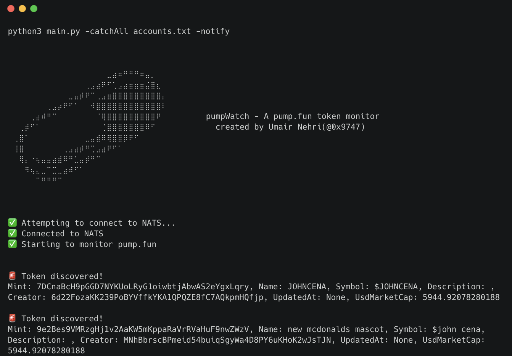

<h1 align="center">pumpWatch 💊</h1>
<p align="center">

</p>
<p align="center"><b>A pump.fun token monitor for you to lock in!</b></p>
<br><br>
<p align ="left">pumpWatch is a token monitor for pump.fun which helps you to detect any newly minted tokens by specific creators. It also has the ability to notify users over Discord and Slack when a new token is discovered with the help of webhooks!</p>


## Installation
The installation for this tool is fairly simple and expects that you already have python installed on your system, after which you can follow the below steps:

1. Clone the repository
```
git clone https://github.com/umair9747/pumpWatch.git
```

2. Create and activate virtual environment
```
python3 -m venv venv
source venv/bin/activate
```

3. Install requirements
```
pip install -r requirements.txt
```

## Usage
There are various ways to use the tool and the usage can be customised with the help of flags.

1. Basic Usage
```
python3 main.py
```
Let's first understand the basic usage. Executing the above line would start a stream of newly minted tokens as output which contains various details such as the token name, ticker, market cap, description etc.

2. Monitoring a single pump.fun account
```
python3 main.py -catch <account>
eg: python3 main.py -catch shitoshi__
eg: python3 main.py -catch HrHJputHcA8mkwrcQB3GkrJ2u1f7Fm4LzAZptSYSsUcf
```
Using the `-catch` flag, users can monitor for any newly created tokens by a specific account on pump.fun!

3. Monitoring multiple pump.fun accounts
```
python3 main.py -catchAll accounts.txt
```
If you'd like to monitor multiple accounts at once, you can create a text file containing all the accounts sepearted by line breaks and then pass it to the tool using the `-catchAll` flag.

4. Notify about discoveries
```
python3 main.py -notify
python3 main.py -catch <account> -notify
python3 main.py -catchAll accounts.txt -notify
```
If you'd like to be notified about any newly discovered tokens in any of the above three cases, you can just add the `-notify` flag as part of the tool execution. In order to use this utility, you will have to populate `notifier.json` with the webhook URLs of Slack and Discord. You can google on how to create the webhook URLs for the same.

<h2> Let's Connect! </h2>
If you have any questions or feedback about Genzai or just want to connect with me, feel free to reach out via <a href="https://x.com/0x9747">Twitter/X</a>, <a href="https://in.linkedin.com/in/umair-nehri-49699317a">LinkedIn</a> or <a href="mailto:umairnehri9747@gmail.com">Email</a>.
</div>
